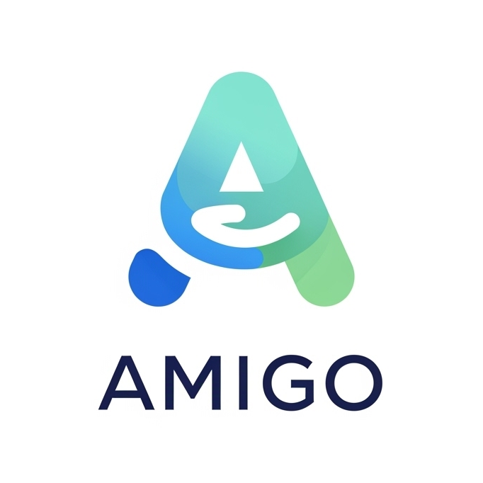

# AMIGO - Assistente Mestre de Informação e Guia Online 🤖
<p align="center">
  
</p>

AMIGO é um chat interativo e inteligente, desenhado para ser uma bússola de saúde pessoal, especialmente para o público idoso. Utilizando o poder da API do Google Gemini, este assistente virtual oferece um canal de comunicação amigável para tirar dúvidas sobre saúde, medicamentos, nutrição e segurança alimentar.

## ✨ Funcionalidades Principais

* **Chat Interativo**: Converse com uma IA treinada para fornecer informações de saúde de forma clara e acessível.
* **Linguagem Simples**: Respostas adaptadas para serem facilmente compreendidas por idosos.
* **Suporte a Imagens**: Envie fotos de medicamentos, rótulos de alimentos ou o que mais precisar para obter uma análise e informações detalhadas.
* **Foco em Saúde do Idoso**: Especializado em ser um guia de nutrição, intérprete de medicamentos e decodificador de informações médicas.
* **Aviso de Responsabilidade**: Todas as respostas incluem um lembrete crucial de que o assistente não substitui a consulta com um profissional de saúde qualificado.

## 🛠️ Tecnologias Utilizadas


* **Frontend**: HTML5, CSS3, JavaScript (ES6 Modules)
* **IA Generativa**: Google Gemini API (`gemini-2.0-flash-lite`)
* **Bundler/Dev Server**: [Vite](https://vitejs.dev/)
* **Markdown Parser**: [Marked](https://marked.js.org/) para formatar as respostas da IA.
* **Hospedagem**: Configurado para deploy na [Vercel](https://vercel.com/).
## 🚀 Como Executar o Projeto
Para rodar este projeto localmente, siga os passos abaixo.
### Pré-requisitos
* [Node.js](https://nodejs.org/) (versão 18 ou superior)
* Um editor de código de sua preferência (ex: [VS Code](https://code.visualstudio.com/))
* Uma chave de API do Google Gemini. Você pode obter uma no [Google AI Studio](https://aistudio.google.com/app/apikey).
### Instalação

1.  **Clone o repositório:**
    ```bash
    git clone [https://github.com/seu-usuario/teu-amigo-virtual.git](https://github.com/seu-usuario/teu-amigo-virtual.git)
    cd teu-amigo-virtual
    ```

2.  **Instale as dependências do projeto:**
    ```bash
    npm install
    ```

3.  **Configure as variáveis de ambiente:**
    * Crie um arquivo `.env` e adicione sua chave da API do Gemini ao arquivo:
        ```
        VITE_GEMINI_API_KEY=SUA_CHAVE_DE_API_AQUI
        ```

4.  **Inicie o servidor de desenvolvimento:**
    ```bash
    npm run dev
    ```

5.  Abra seu navegador e acesse `http://localhost:5173` (ou o endereço indicado no seu terminal).

## 📂 Estrutura do Projeto

O projeto está organizado da seguinte forma para facilitar a manutenção e escalabilidade:
````bash
teu-amigo-virtual/
├── src/
│   ├── helpers/       # Funções auxiliares para manipulação do DOM
│   ├── pages/         # Contém as diferentes páginas da aplicação
│   │   └── home/      # Página principal do chat (HTML, CSS, JS)
│   ├── services/      # Módulos para se comunicar com APIs externas (Gemini)
│   └── style.css      # Estilos globais
├── assets/            # Imagens, vídeos e outros recursos estáticos
├── vite.config.js     # Arquivo de configuração do Vite
├── vercel.json        # Arquivo de configuração para deploy na Vercel
└── package.json       # Dependências e scripts do projeto
````